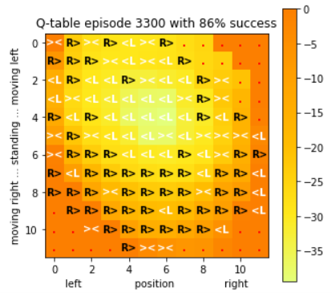

# Q learning - made visible

### Intended audience 

This notebook is for you if you are relatively new to Q learning / reinforcement learning and want to know, how Q learning works on a technical level. Therefore it would be helpful, if you already have some basic knowledge of 
* Reinforcement learning (basic principles, etc.)
* Q learning (Bell equation, etc.)     

If not, please have a look in [Wikipedia](https://en.wikipedia.org/wiki/Q-learning) or similar explanations first. The video https://www.youtube.com/watch?v=1XRahNzA5bE (especially the second part of the video) shows quite well, how Q learning works.     
By running this notebook you should understand a little bit better, what is going on **during** the Q learning process in the **Q table**, which is a **state action matrix** which learns to predict the "right actions" better and better.

### Overview
As in many educational notebooks, we are using one of the [OpenAI environments](http://gym.openai.com/): It's the [Mountain car environment](http://gym.openai.com/envs/MountainCar-v0/). This notebook shows, how Q learning teaches a car (with a weak engine) to drive up a mountain by getting the "right momentum". 

In order to best visualize what's going on, I have choosen this environment because it has a 2-dimensional observation space, which can be shown as a 2-dimensional table. The actions - e.g. speed up to the right - are shown as text (e.g. "R>") in the table: 

Have a look at the [GitHub code](https://github.com/openai/gym/wiki/MountainCar-v0) to know about the details of the observation and action space.
       
### Technical preconditions
Basically there is only one special technical precondition for running this notebook: `gym` has to be installed (see https://gym.openai.com/docs/#installation for the installation notes). 
Neither special AI frameworks (Tensorflow, Pytorch, etc.) nor GPUs are required.   
 
